# Kogge-Stone-adder
# ⚡ High-Speed 4-bit Kogge-Stone Adder | 180nm CMOS | Cadence Virtuoso

This repository showcases the schematic design, physical layout, and simulation of a **4-bit Kogge-Stone Adder (KSA)** using **180nm CMOS technology**, implemented in **Cadence Virtuoso**. The project demonstrates a high-performance, parallel prefix adder architecture optimized for reduced delay, ideal for modern VLSI applications.

---

## 💡 Why Kogge-Stone Adder?

- Fastest carry computation among parallel prefix adders
- Reduced propagation delay with parallel carry generation
- Widely used in processors, DSPs, and arithmetic logic units (ALUs)
- Suitable for low-power, high-speed VLSI circuits

---

## 🛠️ Technical Specifications

| Parameter           | Details                          |
|---------------------|-----------------------------------|
| Technology Node     | 180nm CMOS                       |
| Design Tool         | Cadence Virtuoso                 |
| Focus Areas         | Schematic Design, Layout, DRC, LVS, Simulation |
| Application Target  | High-speed arithmetic circuits in VLSI systems |

---

## 🧩 Design Architecture

### 1️⃣ Pre-processing Stage
- Computes Generate (G) and Propagate (P) signals:
  - `G = A AND B`
  - `P = A XOR B`

### 2️⃣ Carry Generation (Parallel Prefix Network)
- Hierarchical carry computation using Generate-Propagate pairs
- Utilizes Black and Gray cells for fast parallel carry generation

### 3️⃣ Post-processing Stage
- Final Sum calculation:
  - `Sum = P XOR Carry`

---

## 📐 Layout and Physical Design

✅ Custom standard cells: AND, OR, XOR gates (180nm DRC compliant)  
✅ Hierarchical assembly of Half Adder, Generate-Propagate blocks, Full KSA Layout  
✅ Verification:  
- **Design Rule Check (DRC):** Passed  
- **Layout Versus Schematic (LVS):** Passed  
✅ Layout ready for parasitic extraction and post-layout simulation  

---

## 🔬 Simulation and Test Setup

- **Inputs:**  
  - A = `1001` (Decimal 9)  
  - B = `1100` (Decimal 12)  

- **Simulation Details:**  
  - VPULSE sources for A and B inputs  
  - Logic Levels: 0V (LOW) to 1.8V (HIGH)  
  - Transient simulation with a 20ns stop time  

- **Expected Output:**  
  - Sum = `10101` (Decimal 21)  
  - Verified via waveform observation  

---

## 🎨 Project Visuals

Project images are organized under the `images/` folder for clarity:

---

### 📁 Schematics

| Module                  | Schematic Image                                 |
|------------------------|-------------------------------------------------|
| AND Gate               | 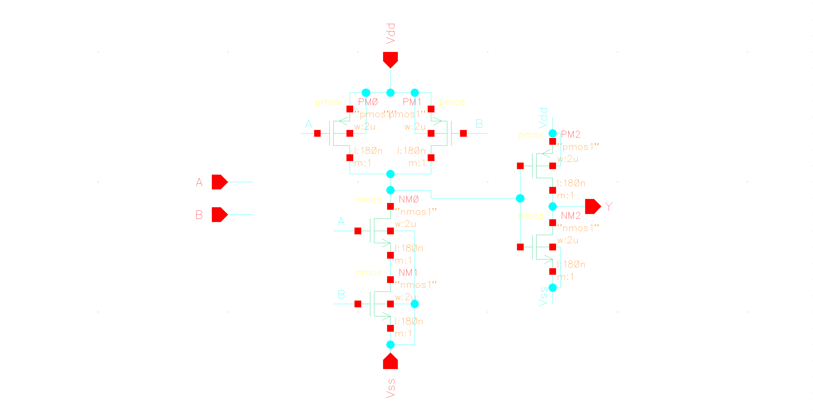 |
| OR Gate                | 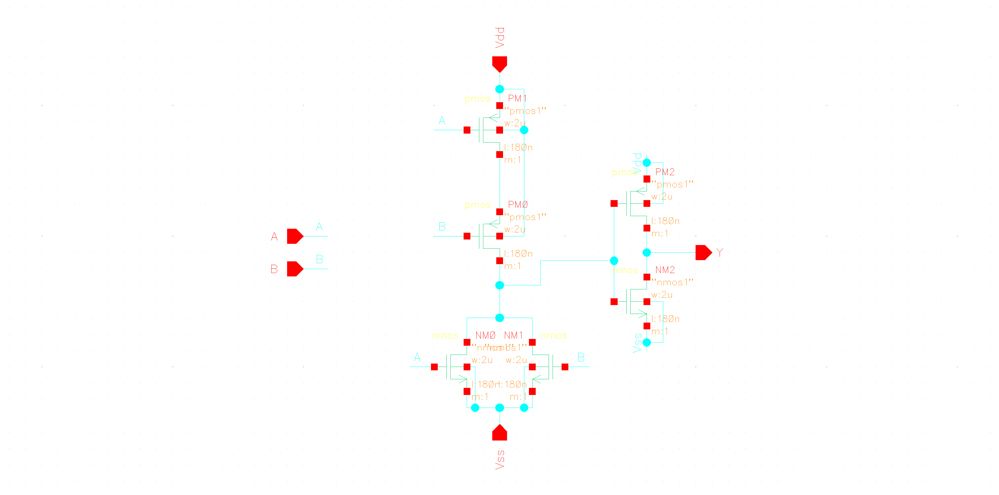   |
| XOR Gate               | 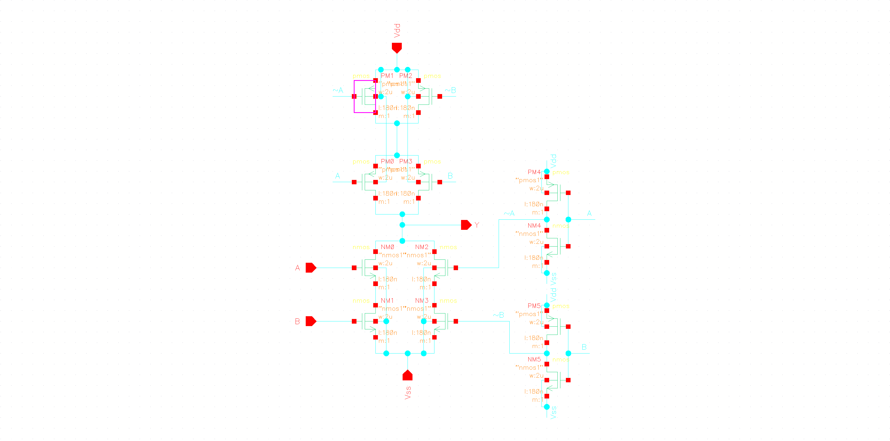 |
| Half Adder             | 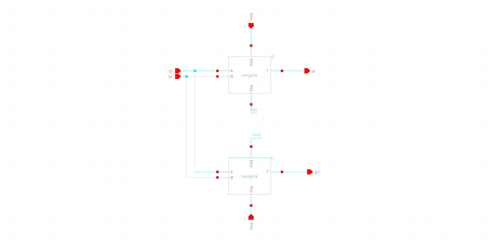 |
| Generate Block         | 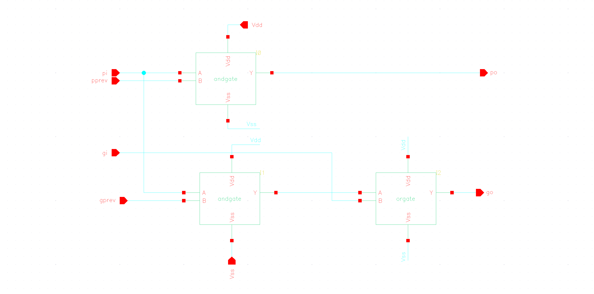 |
| Full Kogge-Stone Adder | 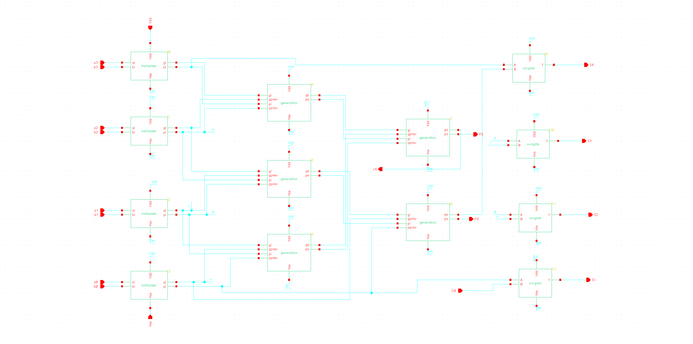 |

---

### 📁 Layouts

| Module                  | Layout Image                                   |
|------------------------|------------------------------------------------|
| AND Gate               | 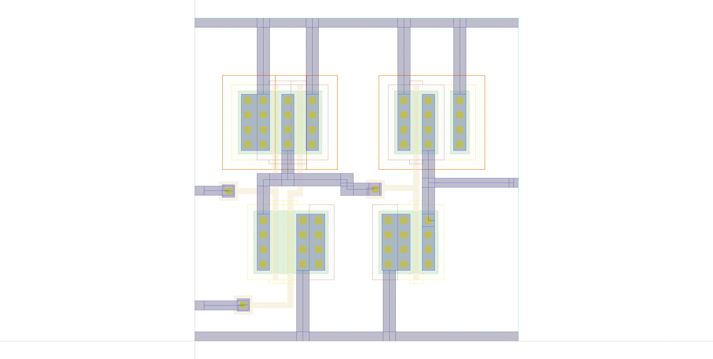   |
| OR Gate                | 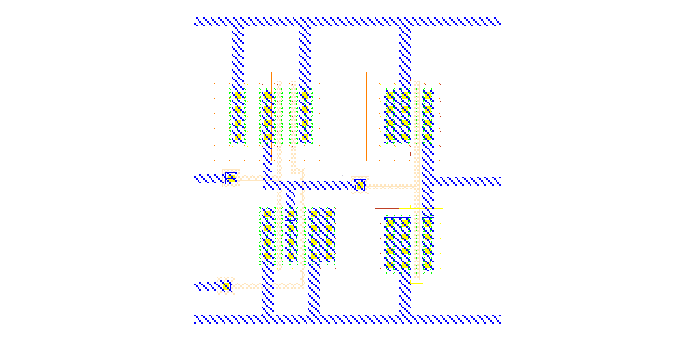     |
| XOR Gate               | 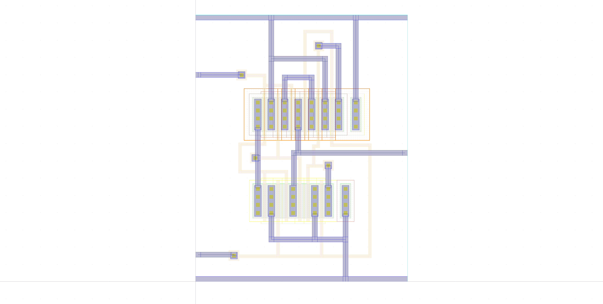   |
| Half Adder             | 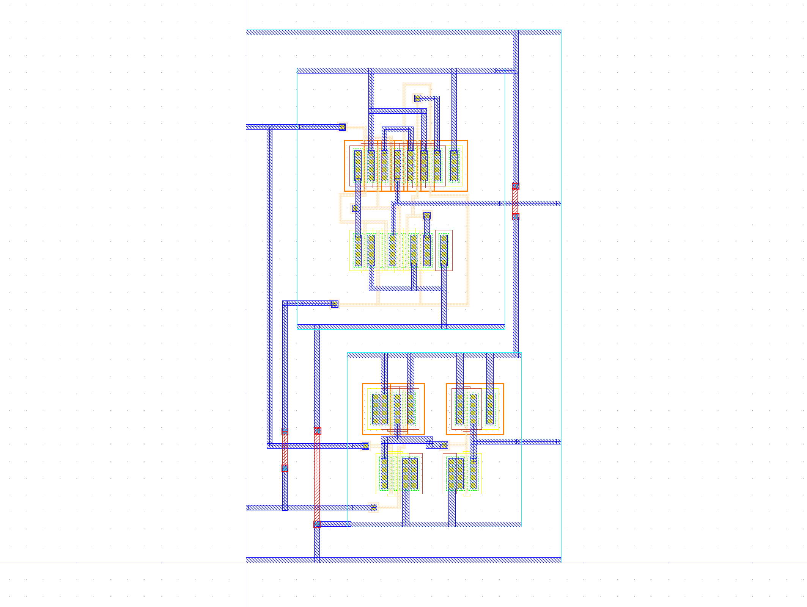 |
| Generate Block         | 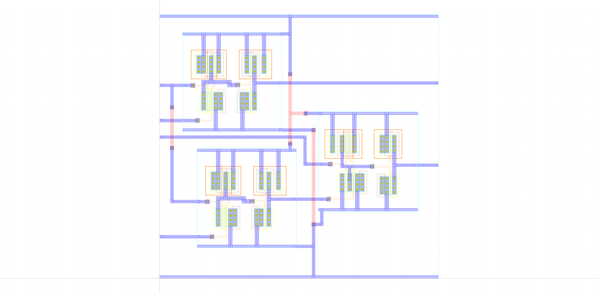 |
| Full Kogge-Stone Adder | 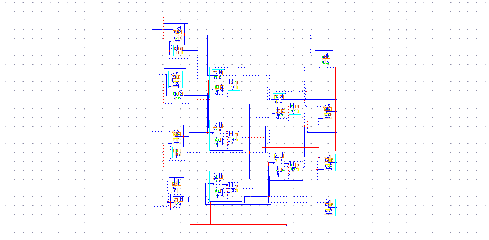   |

---

### 📁 Test Circuits

| Description        | Image                                           |
|-------------------|-------------------------------------------------|
| Testbench Setup   | 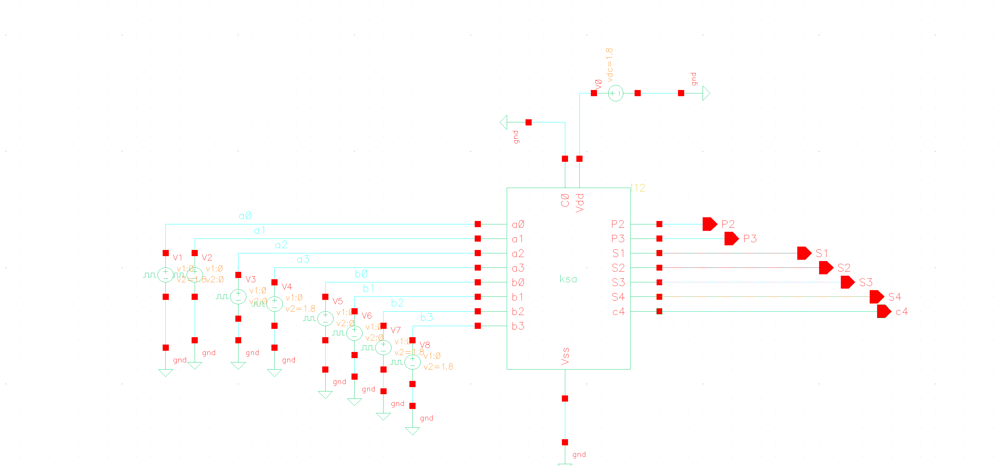 |
| Input Waveform A  | 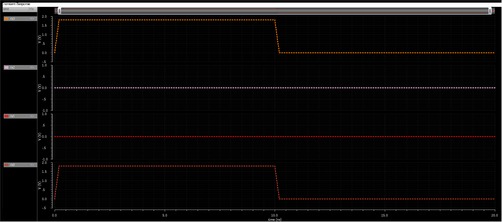    |
| Input Waveform B  | 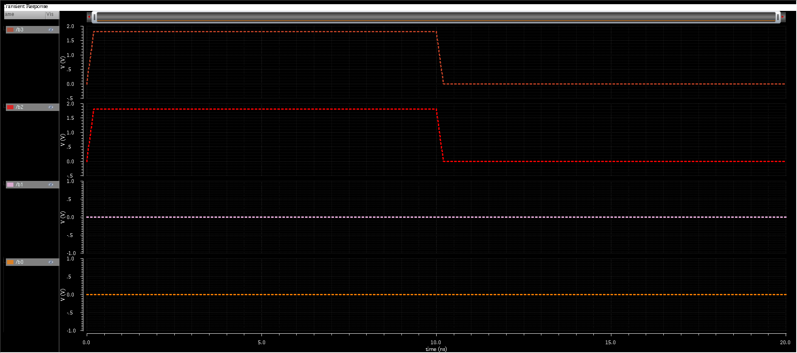    |

---

### 📁 Output Waveforms

| Description               | Image                                                   |
|---------------------------|---------------------------------------------------------|
| Sum Output (Expected 10101)| 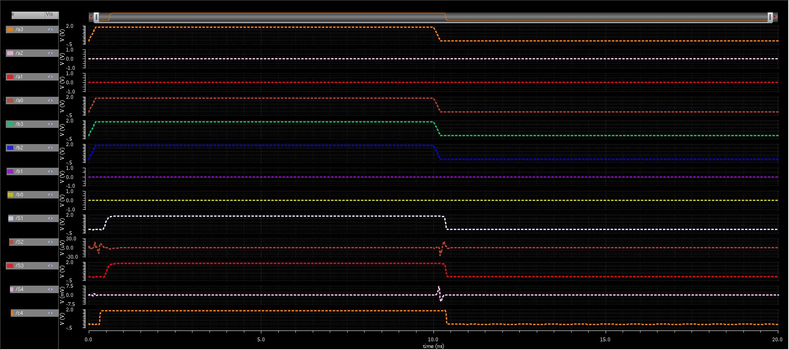 |

---

## ✅ Key Takeaways

✔️ Full VLSI design flow: Schematic → Layout → Verification → Simulation  
✔️ Hands-on Cadence Virtuoso experience for digital logic design  
✔️ Deep understanding of Parallel Prefix Adders and carry-optimization techniques  
✔️ Optimized for high-speed, low-delay arithmetic operations in VLSI  

---

## 👨‍💻 Contributors

- **Rohit J** — [LinkedIn Profile (https://www.linkedin.com/in/rohitj264/)]  
- **Rohan S Paraddi** — [LinkedIn Profile (https://www.linkedin.com/in/rohanparaddi/)]  

---

## 📚 References

- Peter M. Kogge & Harold S. Stone, *A Parallel Algorithm for Efficient Carry Computation*, IEEE, 1973  
- Cadence Virtuoso Official Documentation  
- Industry-standard VLSI Design Methodologies  

---

## 🏁 Conclusion

A functional, verified **4-bit Kogge-Stone Adder** has been successfully designed using 180nm CMOS technology in Cadence Virtuoso. This project covers the complete VLSI cycle, including schematic design, physical layout, verification, and simulation, providing essential skills for high-performance digital circuit development.

---
